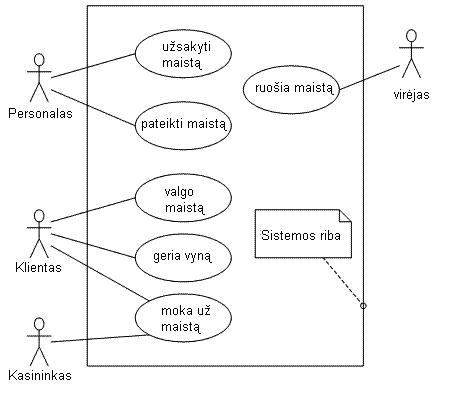
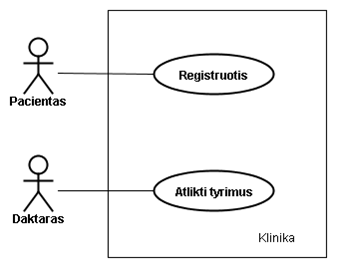
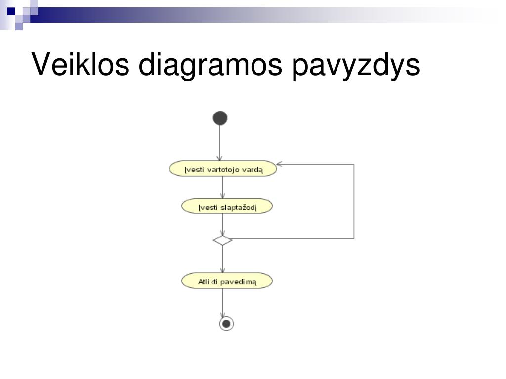
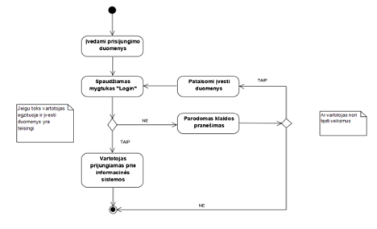
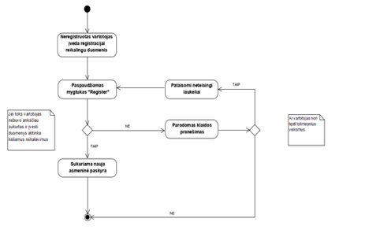
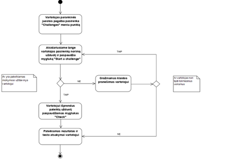
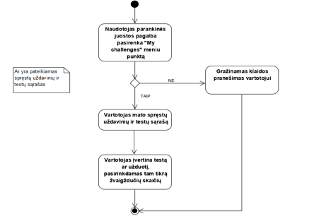
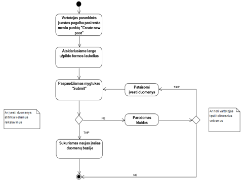

# Pirmoji dalis 03-20

## 1. Sukurti privačią repozitoriją

- Eikite į GitHub ir prisijunkite.
- Viršutiniame dešiniajame kampe spauskite "+" → New repository".
- Įveskite projekto pavadinimą. (Šiai daliai reikės 2 repositorijų. Viena FE, kita BE. Todėl pavadinimas gali būti timer-fe/timer-be)
- Pasirinkite "Private" (kad projektas būtų privatus).
- Spauskite "Create repository".

## 2. Pridėti komandos narius prie projekto

- Eikite į savo repozitoriją.
- Viršuje spauskite "Settings" → kairėje pasirinkite "Collaborators".
- Paspauskite "Add people" ir įveskite GitHub vartotojo vardą arba el. paštą.
- Spauskite "Add collaborator", ir jie gaus kvietimą.
- Pridėkite ir destytoją luxie11, prie abiejų projektų.

## 3. Gauti GitHub projekto URL
- Eikite į GitHub repozitoriją (privatų projektą).
- Viršuje dešinėje paspauskite "Code" mygtuką.
- Pasirinkite "SSH" URL.
- Nukopijuokite URL 
- Naudodami terminalą, naudojant cd komandą nueikite į tą vietą, kur norite išsisaugoti projektus. Rekomenduojama susikurti atskirą folderį abiems projektams
- Panaudoti komandą
- ``git clone <URL>``.

## Antras projekto etapas
Reikia paruošti docx failą, kuriame būtų aprašytas projekto dalys. Šį dokumentą sudaro šios dalys:

1. Funkciniai reikalavimai – pavyzdys

Sistema: E-komercijos svetainė

Pirkimo procesas: Naudotojas turi galėti pasirinkti prekes, pridėti jas į krepšelį, pereiti prie apmokėjimo ir atlikti užsakymą.

Prekių paieška: Sistema turi leisti vartotojams ieškoti prekių pagal pavadinimą, kategoriją, kainą ir pan.

Pirkėjo paskyra: Naudotojas turi turėti galimybę sukurti paskyrą, peržiūrėti užsakymų istoriją ir sekti siuntos būseną.

Nuolaidos ir akcijos: Sistema turi palaikyti nuolaidų kuponus, kuriais galima atsiskaityti už prekes.

2. Ne-funkciniai reikalavimai – pavyzdžiai

Sistema: Socialinių tinklų platforma

Našumas: Sistemos atsako laikas nuo puslapio užkrovimo turi būti ne ilgesnis nei 2 sekundės.

Saugumas: Visi vartotojo slaptažodžiai turi būti užšifruoti naudojant šiuolaikines šifravimo algoritmus (pvz., bcrypt).

Patikimumas: Sistema turi būti pasiekiama 99,9% laiko per metus. Jei įvyksta sutrikimai, turi būti numatyti atstatymo planai.

Skalavimas: Sistema turi galėti palaikyti 1 milijoną aktyvių vartotojų ir greitai prisitaikyti prie didėjančio srauto.

3. Naudotojo reikalavimai – pavyzdžiai

Sistema: Naujienų portalas

Vartotojo sąsaja: Programėlė turi būti paprasta ir prisitaikanti įvairiems įrenginiams.

Naudojimo patirtis: Programėlė turi veikti sklandžiai, naudojant visas populiariasias interneto naršykles.

Kalbos palaikymas: Programėlė turi būti prieinama anglų, lietuvių kalbomis. (Gali būti viena kalba)

4. Technologiniai reikalavimai – pavyzdžiai

Sistema: Įmonės vidinė duomenų analizės platforma

Programavimo kalbos ir įrankiai: Sistema bus sukurta naudojant Python ir Flask (backend), React.js (frontend), MySQL duomenų bazė. (Šios dalies nereikia keisti, nes visa medžiaga bus naudojama kurso metu, nebent norima naudoti kitus įrankius.)

## Sekantis projekto etapas.

UML (Unified Modeling Language) diagramų rinkinys yra naudingas įrankis programinės įrangos kūrimo ir projektavimo procese, tai padeda vizualizuoti ir susisteminti sistemos komponentus bei jų sąveikas. UML diagramas galima naudoti tiek techniniams specialistams (programuotojams, architektams), tiek ir verslo analitikams bei klientams, kad būtų lengviau suprasti, kaip veikia sistema. 

Šiame dokumente apžvelgsime pagrindinius UML diagramų tipus ir jų naudojimo atvejus projekte.

## 1. Klasių diagramos (Class Diagram)

- **Naudojimas**: Klasių diagrama vaizduoja objekto orientuotos sistemos struktūrą, apibrėžiant klasės, jų atributus, metodus ir ryšius su kitomis klasėmis.
- **Kam reikalinga projekte**: Padeda suprasti, kaip duomenys ir funkcionalumas yra organizuojami sistemoje. Klasės diagramas naudoja programuotojai ir architektai, kad galėtų kurti objekto orientuoto kodo struktūrą.
- **Pavyzdys**: Elektroninės parduotuvės sistemoje klasės gali būti „Prekė“, „Užsakymas“, „Klientas“ ir pan.

## 2. Sekos diagramos (Sequence Diagram)

- **Naudojimas**: Sekos diagrama vaizduoja, kaip objektai ar komponentai sąveikauja tarpusavyje pagal laiką, parodydama žingsninius įvykius ir jų užsakymo seką.
- **Kam reikalinga projekte**: Šios diagramas padeda suprasti, kaip įvairūs sistemos komponentai keičiasi žinutėmis ir kaip vyksta operacijos per laiką. Tai ypač naudinga kuriant realaus laiko sistemas arba API integracijas.
- **Pavyzdys**: „Naudotojo prisijungimo procesas“: kaip sistema priima naudotojo duomenis, tikrina jų teisingumą ir siunčia atsakymą.

## 3. Panaudojimo atvejų diagramos (Use Case Diagram)

- **Naudojimas**: Panaudojimo atvejų diagrama vaizduoja, kaip vartotojai (aktoriai) sąveikauja su sistema ir kokius funkcionalumus jie gali atlikti. Tai padeda nustatyti sistemos funkcijas ir vartotojų reikalavimus.
- **Kam reikalinga projekte**: Ši diagrama yra naudinga per reikalavimų analizės etapą, kad būtų lengviau identifikuoti pagrindines funkcijas, kurias turi atlikti sistema. Taip pat ji padeda pristatyti sistemą klientams ar suinteresuotoms šalims.
- **Pavyzdys**: E-komercijos sistemos naudotojas gali atlikti „Registraciją“, „Prekių peržiūrą“, „Pirkimo užsakymą“.

## 4. Komponentų diagramos (Component Diagram)

- **Naudojimas**: Komponentų diagrama vaizduoja, kaip sistemos komponentai (pvz., modulis, biblioteka, paslaugos) sąveikauja tarpusavyje ir kaip jie organizuojami.
- **Kam reikalinga projekte**: Padeda suprasti sistemos architektūrą ir kaip jos komponentai sąveikauja. Tai dažnai naudinga didelėse ir sudėtingose sistemose.
- **Pavyzdys**: Web aplikacijos, kur backend, frontend ir duomenų bazė yra atskiri komponentai, o komponentų sąveikos apibrėžiamos.

## 5. Veiklos diagramos (Activity Diagram)

- **Naudojimas**: Ši diagrama rodo, kaip vyksta procesas ar darbo eiga, iliustruodama veiksmų seką ir pasirinkimo kelius.
- **Kam reikalinga projekte**: Padeda modeliuoti verslo procesus ir veiksmus sistemoje. Tai naudinga, kai norite optimizuoti darbo srautą arba suprasti, kaip veikia sudėtingas verslo procesas.
- **Pavyzdys**: Pirkimo proceso eiga elektroninėje parduotuvėje: nuo prekių pasirinkimo iki apmokėjimo.

## 6. Duomenų srautų diagramos (Data Flow Diagram)

- **Naudojimas**: Duomenų srautų diagrama vaizduoja, kaip duomenys juda sistemoje ir kaip jie yra apdorojami. Ji rodo procesus, duomenų saugojimo vietas ir duomenų srautus.
- **Kam reikalinga projekte**: Naudojama analizuojant, kaip duomenys pereina per sistemą, ir padeda užtikrinti, kad visi duomenų srautai yra tvarkomi tinkamai.
- **Pavyzdys**: Duomenų srautai nuo užsakymo pateikimo formos iki duomenų bazės ir vėliau prie siuntimo proceso.

## 7. Paketų diagramos (Package Diagram)

- **Naudojimas**: Paketų diagrama vaizduoja, kaip sistemos elementai (klasės, komponentai) yra suskirstyti į grupes, vadinamas paketais.
- **Kam reikalinga projekte**: Ši diagrama padeda organizuoti ir suskirstyti projektą į loginius paketus arba modulius. Tai padeda pagerinti sistemos struktūrą ir suprasti komponentų priklausomybę.
- **Pavyzdys**: Programoje galima turėti paketą „Naudotojo valdymas“, „Pirkimo procesas“, „Ataskaitos generavimas“.

## 8. Būsenos diagramos (State Diagram)

- **Naudojimas**: Būsenos diagrama rodo objekto būsenas ir įvykius, kurie sukelia būsenų pokyčius. Tai dažnai naudojama, kai objekto gyvenimo ciklas yra svarbus (pavyzdžiui, užsakymo statusas).
- **Kam reikalinga projekte**: Naudojama, kai reikia sukurti objektų, kurie turi skirtingas būsenas (pvz., užsakymų, vartotojų, prekių), modelį.
- **Pavyzdys**: Užsakymo būsenos gali būti „Gavimas“, „Apdorojimas“, „Išsiųsta“, „Atšaukta“.

Daugiau informacijos https://www.mindonmap.com/lt/blog/what-is-uml-diagram/

Šioje dalyje Jums reikia nubrėžti veiklos diagramas. Remdamiesi savo vakar dienos aprašytais punktais turite nubrėžti veiklos diagramas ir panaudos atvėjų diagramą.

Panaudos atvėjų diagrama sudaro roles/vartotojai ir kokius veiksmus galės atlikti tam tikras vartotojas. Žemiau pateikiamas pavyzdys:

Veiklos diagrama, tai kokius veiksmus reikia atlikti, kad šis funkcionalumas būtų įgyvendintas, žemiau yra pateikiamas pavyzdys banko mokėjimas. Rombas nurodo, kad jeigu vartotojas įves blogus duomenis, vartotojas bus gražinamas į pradžią ir jam šiuos veiksmus reikės atlikti iš naujo, tai įvesti vartotojo vardą ir slaptažodį.

Pateikiu dar keleta pavyzdžių:

